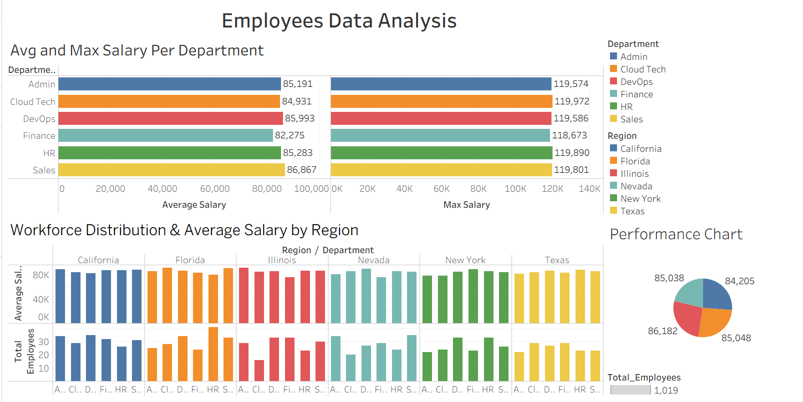

# Employee Data Cleaning & Analytics Pipeline

	An end-to-end Data Engineering project demonstrating data validation, cleaning, SQL business views, and Tableau dashboard development using a real-world employee dataset.

---

# Project Overview

	This project focuses on transforming raw employee data into business-ready datasets.

	The workflow starts with a messy employee dataset, performs data validation and cleaning using Python and Pandas, loads the cleaned data into MySQL, creates SQL business views, and finally visualizes key business insights through an interactive Tableau dashboard.

---

# Project Architecture

```
	Raw Employee Dataset
	        │
	        ▼
	Data Inspection
	        │
	        ▼
	Data Validation
	        │
	        ▼
	Data Cleaning (Pandas)
	        │
	        ▼
	Cleaned Employee Dataset
	        │
	        ▼
	Load into MySQL
	        │
	        ▼
	Business SQL Views
	        │
	        ▼
	Tableau Dashboard
```

---

# Tech Stack

	- Python
	- Pandas
	- NumPy
	- MySQL
	- SQL Views
	- Tableau Desktop
	- Git
	- GitHub
	- VS Code
	- WSL (Ubuntu)

---

# Project Structure

```
	DataCleaning/
	│
	├── README.md
	│
	├── data/
	│   ├── raw/
	│   │   ├── Messy_Employee_dataset.csv
	│   │   ├── messy_orders.csv
	│   │   └── invalid_employee.csv
	│   │
	│   └── cleaned/
	│       ├── Cleaned_Employee_Dataset.csv
	│       └── valid_employee.csv
	│
	├── src/
	│   ├── validation_script.py
	│   ├── data_cleaning.py
	│   ├── pd_data_cleaning1.py
	│   └── load_to_mysql.py
	│
	├── sql/
	│   └── create_views.sql
	│
	├── Dashboard/
	│   └── Employees_Data_Analysis.twb
	│
	└── Documentation/
	    └── Data_cleaning.txt
```

---

# Features

	✔ Data Validation
	
		- Duplicate detection
		- Missing value inspection
		- Phone number validation
		- Salary validation
		- Date format validation
		
	✔ Data Cleaning

		- Standardized inconsistent values
		- Removed invalid records
		- Cleaned phone numbers
		- Fixed inconsistent date formats
		- Standardized categorical values
		- Vectorized Pandas operations

	✔ SQL

		- Loaded cleaned dataset into MySQL
		- Created business-ready SQL Views
		- Aggregated department metrics
		- Aggregated regional insights

	✔ Tableau Dashboard

	Interactive dashboard including:

		- Average Salary by Department
		- Maximum Salary by Department
		- Workforce Distribution by Region
		- Average Salary by Region
		- Employee Performance Chart
		- Interactive Department Filter
		- Interactive Region Filter

---

# Dashboard Preview

```
Dashboard/dashboard_preview.png
```

Example:

```markdown

```

---

# Dashboard Insights

### Average & Maximum Salary Per Department

	Compares department-wise average salary against maximum salary to identify compensation trends.

### Workforce Distribution

	Displays employee count across different regions and departments.

### Regional Salary Analysis

	Shows how average salaries vary across multiple states.

### Performance Chart

	Provides an overall comparison of departmental salary performance.

### Interactive Filters

	Users can filter dashboard results by:

	- Department
	- Region

---

# SQL Views

	Business views were created for reporting purposes.

Example:

	- Department Summary
	- Regional Workforce Summary
	- Salary Summary
	
These views simplify reporting and improve dashboard performance.

---

# Learning Outcomes

Through this project I learned:

	- Real-world data validation
	- Data cleaning using Pandas
	- Vectorized transformations
	- SQL View creation
	- Tableau Dashboard development
	- Git version control
	- End-to-End Data Engineering workflow

---

# Future Improvements

	- Logging
	- Configuration files
	- Airflow orchestration
	- Docker containerization
	- Data Quality Reports
	- Automated ETL Scheduling

---

# Author

**Dasari Shanmukha Vishnu**

LinkedIn:
https://www.linkedin.com/in/shanmukha-vishnu-dasari-7860ab334/

GitHub:
https://github.com/dasarishanmukhavishnu

---

# License

This project is created for learning and portfolio purposes.


